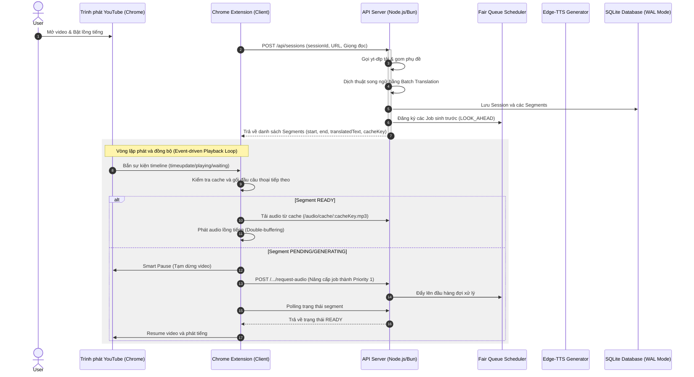

# LiveTube Voice Dubber V2 - Kiến trúc Hệ thống & Lựa chọn Công nghệ

Tài liệu này ghi nhận toàn bộ thiết kế kiến trúc kỹ thuật và các quyết định công nghệ cốt lõi của phiên bản V2, nhằm phục vụ việc kế thừa và phát triển cho các phiên bản tiếp theo.

---

## 1. Sơ đồ Kiến trúc & Dòng chảy Dữ liệu (Mermaid)

---

## 2. Triết lý Thiết kế Stateless Backend

Để khắc phục triệt để các lỗi xung đột trạng thái (race condition) giữa các tab của phiên bản V1, phiên bản V2 chuyển đổi hoàn toàn sang kiến trúc **Stateless Backend**:

1.  **Server không giữ trạng thái phát**:
    *   Backend hoàn toàn không biết client đang ở giây thứ mấy, đang phát câu nào, hay tab nào đang active.
    *   Toàn bộ logic theo dõi tiến trình (timeline update), hoán đổi buffer (double buffering), điều chỉnh âm lượng (fade-ducking) và ra quyết định tạm dừng/phát được thực thi trực tiếp trên **Chrome Extension**.
2.  **Giao tiếp qua API hướng sự kiện (On-Demand & Polling)**:
    *   Extension chủ động yêu cầu backend sinh gấp âm thanh (`POST /request-audio`) khi tiến trình sắp chạm đến câu chưa sẵn sàng.
    *   Server chỉ đóng vai trò là một dịch vụ tính toán (Dịch thuật, sinh âm thanh) và phân phối tệp tin tĩnh (Audio Serving).
3.  **Cô lập Session ID phía Client**:
    *   Mỗi khi người dùng chuyển trang hoặc tải lại trang trên YouTube, sự kiện `yt-navigate-finish` của YouTube SPA kích hoạt, extension sẽ tự động sinh một `sessionId` ngẫu nhiên mới (UUID v4).
    *   Điều này giúp cô lập hoàn toàn tiến trình dịch và các câu thoại của video hiện tại, tránh bị nhiễm chéo dữ liệu từ video đã xem trước đó.

---

## 3. SQLite WAL Mode & Prepared Statements (Database Layer)

CSDL SQLite được cấu hình ở mức an toàn tối đa cho môi trường đa luồng và đa tab:

*   **Write-Ahead Logging (WAL Mode)**:
    *   Kích hoạt thông qua truy vấn `PRAGMA journal_mode=WAL;`.
    *   Cho phép nhiều luồng đọc và một luồng ghi hoạt động **đồng thời** mà không bị block lẫn nhau. Khắc phục hoàn toàn lỗi `SQLITE_BUSY` khi người dùng mở nhiều tab YouTube cùng lúc.
*   **Thiết lập busy_timeout**:
    *   Cấu hình `PRAGMA busy_timeout = 5000;` bắt SQLite phải đợi tối đa 5 giây nếu database đang bận ghi, thay vì lập tức trả về lỗi crash hệ thống, giúp củng cố độ bền bỉ khi đa tab đọc ghi song song.
*   **Prepared Statements tập trung**:
    *   Toàn bộ câu lệnh SQL được biên dịch sẵn một lần duy nhất lúc khởi động server trong file [db.ts](file:///Users/phamminhtri/Desktop/train/LiveTube-Voice-Dubber_v2/src/db.ts).
    *   Tối ưu hóa tốc độ thực thi của SQLite ở mức micro-giây, ngăn chặn hoàn toàn lỗi SQL Injection.
*   **Thiết kế Bảng CSDL**:
    *   `sessions`: Lưu cấu hình phiên dịch của từng video (UUID, URL gốc, ngôn ngữ, thời gian truy cập gần nhất).
    *   `segments`: Lưu trữ timeline chi tiết của từng câu thoại (index, start, end, câu gốc, câu dịch, trạng thái âm thanh).
    *   `jobs`: Quản lý hàng đợi sinh TTS (priority, trạng thái, thời gian tạo).

---

## 4. Cấu trúc Chrome Extension (Client Layer)

*   **Biên dịch bằng esbuild**:
    *   Đóng gói toàn bộ mã nguồn TypeScript (`extension/src/`) thành một file JavaScript duy nhất (`extension/dist/content.js`) chỉ trong **10-15ms**.
    *   Không sử dụng Webpack cồng kềnh, giữ dung lượng file bundle cực kỳ tối giản (~42kb), giúp trang YouTube tải cực nhanh.
*   **Shadow DOM Cô lập**:
    *   Giao diện cài đặt và phụ đề lồng tiếng được vẽ bên trong một lớp **Shadow DOM** độc lập.
    *   Ngăn chặn hoàn toàn việc xung đột CSS giữa extension và trang gốc của YouTube. YouTube không thể làm hỏng giao diện của chúng ta và ngược lại.
